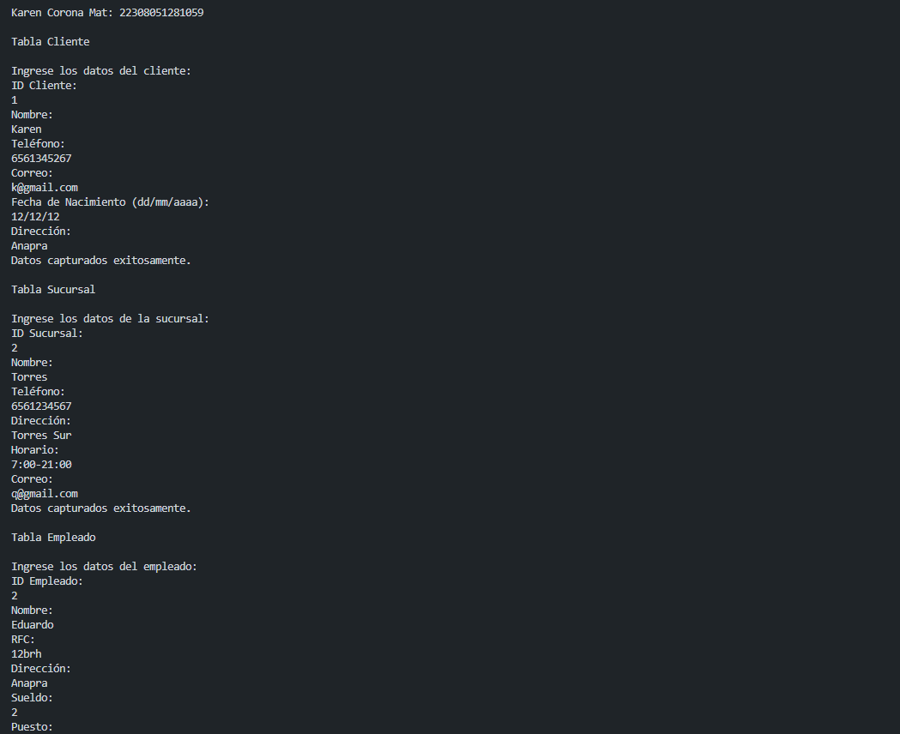
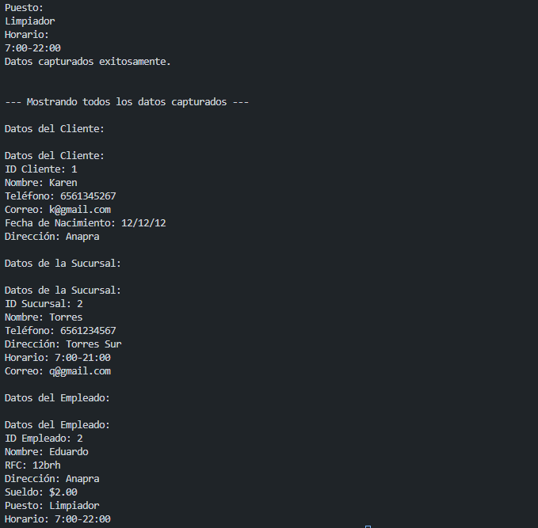

crear una clase cliente con atributos id_cliente, nombre, telefono, correo, fecha_nacimiento, direccion, una función captura() y otra mostrar datos(), crear la instancia y utilizar los atributos y llamadas a funciones lenguaje dart

crear una clase sucursal con atributos id_sucursal, nombre, telefono, direccion,horario,correo una función captura() y otra mostrar datos(), crear la instancia y utilizar los atributos y llamadas a funciones lenguaje dart

crear una clase empleado con atributos id_empleado, nombre, rfc, direccion,sueldo,puesto,horario una función captura() y otra mostrar datos(), crear la instancia y utilizar los atributos y llamadas a funciones lenguaje dart

SALIDA

