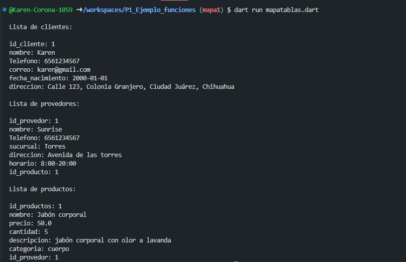

crear un map <string, dynamic> clientes con los siguientes key,id_cliente,nombre,telefono,correo,fecha_nacimiento,direccion. 
y mostrar los datos con un for each,lenguaje Dart

crear un map <string, dynamic> provedor con los siguienteskey,id_provedor,nombre,telefono,sucursal,direccion,horario,id_producto.
 mostrar los datos con un for each,lenguaje Dart

crear un map <string, dynamic> producto con los siguientes key,id_producto,nombre,precio,cant,descripcion,categoria, id_provedor. 
y mostrar los datos con un for each,lenguaje Dart

Salida de datos

