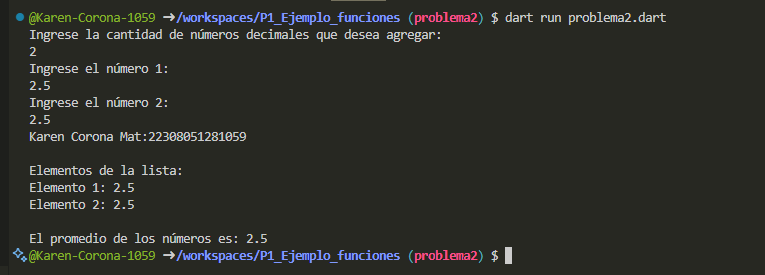

Programa que tome una lista de números decimales (double) y calcule el promedio de los valores que utilice 2 funciones una para capturar datos de la lista y otra para mostrar los elementos en dart

Resultado:

